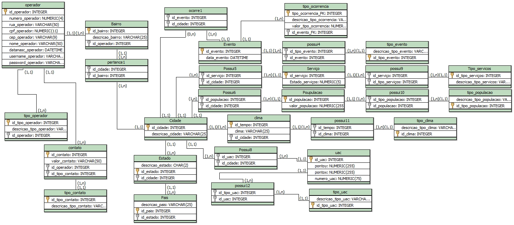

# TRABALHO 01
Trabalho desenvolvido durante a disciplina de BD

# Sumário

### 1.COMPONENTES 
Álvaro Vinicius de Almeida Martins (alvarovinicius7@gmail.com) e Gabriel Gonçalves de Oliveira (gaabrielws@hotmail.com) 

### 2.INTRODUÇÃO E MOTIVAÇAO 
Nosso projeto é o AUCSYS, sigla em inglês para para "Anti Urban Chaos SYStem"(Sistema anti caos urbano). Ficamos motivados em fazer esse sistema por existir poucos sistemas do gênero, onde os operadores agem indiretamente para tornar a vida da população de uma cidade mais segura. O sistema traz a ideia de geografia e estratégia, mapeando riscos e áreas de risco para a população e analisando as melhores maneiras de se manter as pessoas seguras durante uma crise. 

### 3.MINI-MUNDO 
O sistema terá o nome das cidades mais várias localidades de cada cidade, divididas em "setores". Poderá armazenar localidades de risco, número da população da área (pêndulo e fixa), possíveis causas de desastre e suas chancesde ocorrer, sistemas de saneamento básico, safezones (abrigos) disponíveis, possíveis rotas de trânsito, clima, organizará acontecimentos passados e seus dados como mortos, feridos e custos de reparação. Terá um medidor de risco para cada localidade onde será classificado por risco grave, mediano e baixo e também uma organização das localidades que acontecem desastres frequentes para assim ter uma eficacia de prevenção. Poderá também alertar lugares que estão interditados, como, queda de barragens, pontes quebradas, buracos, alagamentos e avisará acontecimentos que poderá ocorrer um certo tipo de desastre sendo grave, mediano ou baixo. 

### 4.RASCUNHOS BÁSICOS DA INTERFACE (MOCKUPS) 
Modelo esquemático do sistema  

https://github.com/AUCSYS/Trabalho01/blob/master/AUCSYS_ULTIMATE_GabrielGon%C3%A7alves_AlvaroMartins.pdf  

### 5.MODELO CONCEITUAL 
    a) NOTACAO ENTIDADE RELACIONAMENTO

    
    b) NOTACAO UML (Caso esteja fazendo a disciplina de analise)

#### 5.1 Validação do Modelo Conceitual
    [Grupo01]: Sabrina Leal e Gabriel Plotheger
    [Grupo02]: Luciano Lima e Vinicius da Hora

#### 5.2 DECISÕES DE PROJETO
    [coordenada]: [Atributo composto]
    
    a) Campo coordenada: Optamos por um campo composto, pois para localizar os locais de unidades de apoio civil no mapa precisamos dos pontos x e y. 
    b) Para poder achar a localização das unidades de apoio civil.
    
    [tipo_ocorencia]: [Atributo composto]
    
    a) Campo tipo_ocorrencia: Optamos por um campo composto, pois no sistema mostrará o tipo da ocorrência e o valor em que a ocorrência irá causar.
    b) Para ter informações de que tipo é a orrência e o valor do dano em que ela vai causar. 

#### 5.3 DESCRIÇÃO DOS DADOS 
    [objeto]: [descrição do objeto]
    
    EXEMPLO:
    CLIENTE: Tabela que armazena as informações relativas ao cliente 
    CPF: campo que armazena o número de Cadastro de Pessoa Física para cada cliente da empresa. 
    
    OPERADOR: Tabela que armazena as informações relativas ao operador do sistema. 
        ID_OPERADOR: Campo que armazena o código único de cada operador. 
        NUMERO_OPERADOR: Campo que armazena o número da residência de cada operador. 
        RUA_OPERADOR: Campo que armazena a rua da residência de cada operador. 
        CPF_OPERADOR: Campo que armazena o número de Cadastro de Pessoa Física de cada operador. 
        CEP_OPERADOR: Campo que armazena o número de Código de Endereçamento Postal de cada operador.  
        NOME_OPERADOR: Campo que armazena o nome completo de cada operador. 
        USERNAME_OPERADOR: Campo que armazena o nome de usuário de cada operador. 
        DATANASC_OPERADOR: Campo que armazena a data de nascimento de cada operador. 
        PASSWORD_OPERADOR: Campo que armazena a senha de cada operador. 
    TIPO_OPERADOR: Tabela que armazena os tipos de operador existentes no sistema. 
        ID_TIPO_OPERADOR: Campo que armazena o código único de cada tipo de operador. 
        DESCRICAO_TIPO_OPERADOR: Campo que armazena uma descrição do tipo de operador. 
    CONTATO: Tabela que armazena dados de contatos de cada operador no sistema. 
        ID_CONTATO: Campo que armazena o código único de cada contato no sistema. 
        VALOR_CONTATO: Campo que armazena os dados do contato de cada operador. 
    TIPO_CONTATO: Tabela que armazena os tipos de contato de operador existentes no sistema. 
        ID_TIPO_CONTATO: Campo que armazena o código único de cada tipo de contato do operador. 
        DESCRICAO_TIPO_CONTATO: Campo que armazena uma descrição do tipo de contato do operador. 
    BAIRRO: Tabela que armazena dados sobre bairros da cidade cadastrada no sistema. 
        ID_BAIRRO: Campo que armazena o código único para cada bairro cadastrado no sistema. 
        DESCRICAO_BAIRRO: Campo que armazena informações sobre o bairro da cidade. 
    CIDADE: Tabela que armazena dados sobre cada cidade cadastrada no sistema. 
        ID_CIDADE: Campo que armazena o código único para cada cidade cadastrada no sistema. 
        DESCRICAO_CIDADE: Campo que armazena informações sobre a cidade cadastrada. 
    ESTADO: Tabela que armazena dados sobre os Estados cadastrados no sistema. 
        ID_ESTADO: Campo que armazena o código único para cada Estado cadastrado no sistema. 
        DESCRICAO_ESTADO: Campo que armazena informações sobre o estado cadastrado. 
    PAIS: Tabela que armazena dados sobre os países cadastrados no sistema. 
        ID_ESTADO: Campo que armazena o código único para cada país cadastrado no sistema. 
        DESCRICAO_ESTADO: Campo que armazena informações sobre o país cadastrado.      

### 6	MODELO LÓGICO 

   

### 7	MODELO FÍSICO 

CREATE TABLE Bairro (
id_bairro VARCHAR(10) PRIMARY KEY,
descricao_bairro VARCHAR(25)
);

CREATE TABLE tipo_populacao (
id_tipo_populacao VARCHAR(10) PRIMARY KEY,
descricao_tipo_populacao VARCHAR(10)
);

CREATE TABLE tipo_clima (
id_clima VARCHAR(10) PRIMARY KEY,
descricao_tipo_clima VARCHAR(255)
);

CREATE TABLE clima (
id_tempo VARCHAR(10) PRIMARY KEY,
clima VARCHAR(25)
);

CREATE TABLE Estado (
id_estado VARCHAR(10) PRIMARY KEY,
descricao_estado VARCHAR(25)
);

CREATE TABLE Pais (
id_pais VARCHAR(10) PRIMARY KEY,
descricao_pais VARCHAR(25)
);

CREATE TABLE Evento (
id_evento VARCHAR(15) PRIMARY KEY,
data_evento DATETIME,
descricao_tipo_ocorrencia VARCHAR(255),
valor_tipo_ocorrencia VARCHAR(25)
);

CREATE TABLE Serviço (
id_serviço VARCHAR(15) PRIMARY KEY,
Estado_serviços NUMERIC(3)
);

CREATE TABLE tipo_evento (
descricao_tipo_evento VARCHAR(15),
id_tipo_evento VARCHAR(10) PRIMARY KEY
);

CREATE TABLE Cidade (
id_cidade VARCHAR(10) PRIMARY KEY,
descricao_cidade VARCHAR(25),
id_estado VARCHAR(10),
FOREIGN KEY(id_estado) REFERENCES Estado (id_estado)
);

CREATE TABLE tipo_uac (
id_tipo_uac VARCHAR(10) PRIMARY KEY,
descricao_tipo_uac VARCHAR(10)
);

CREATE TABLE Tipo_servicos (
id_tipo_serviços VARCHAR(10) PRIMARY KEY,
descricao_tipo_servicos VARCHAR(255)
);

CREATE TABLE Poupulacao (
id_populacao VARCHAR(10) PRIMARY KEY,
valor_populacao NUMERIC(255)
);

CREATE TABLE uac (
id_uac VARCHAR(10) PRIMARY KEY,
pontoy VARCHAR(10),
pontox VARCHAR(10),
numero_uac VARCHAR(10),
id_tipo_uac VARCHAR(10),
FOREIGN KEY(id_tipo_uac) REFERENCES tipo_uac (id_tipo_uac)
);

CREATE TABLE ocorre1 (
id_cidade VARCHAR(10),
id_evento VARCHAR(10),
FOREIGN KEY(id_cidade) REFERENCES Cidade (id_cidade),
FOREIGN KEY(id_evento) REFERENCES Evento (id_evento)
);

CREATE TABLE Pertence3 (
id_pais VARCHAR(10),
id_estado VARCHAR(10),
FOREIGN KEY(id_pais) REFERENCES Pais (id_pais),
FOREIGN KEY(id_estado) REFERENCES Estado (id_estado)
);

CREATE TABLE Possui5 (
id_serviço VARCHAR(10),
id_cidade VARCHAR(10),
FOREIGN KEY(id_serviço) REFERENCES Serviço (id_serviço),
FOREIGN KEY(id_cidade) REFERENCES Cidade (id_cidade)
);

CREATE TABLE Possui6 (
id_populacao VARCHAR(10),
id_cidade VARCHAR(10),
FOREIGN KEY(id_populacao) REFERENCES Poupulacao (id_populacao),
FOREIGN KEY(id_cidade) REFERENCES Cidade (id_cidade)
);

CREATE TABLE Possui7 (
id_tempo VARCHAR(10),
id_cidade VARCHAR(10),
FOREIGN KEY(id_tempo) REFERENCES clima (id_tempo),
FOREIGN KEY(id_cidade) REFERENCES Cidade (id_cidade)
);

CREATE TABLE Possui8 (
id_uac VARCHAR(10),
id_cidade VARCHAR(10),
FOREIGN KEY(id_uac) REFERENCES uac (id_uac),
FOREIGN KEY(id_cidade) REFERENCES Cidade (id_cidade)
);

CREATE TABLE possui9 (
id_tipo_serviços VARCHAR(10),
id_serviço VARCHAR(10),
FOREIGN KEY(id_tipo_serviços) REFERENCES Tipo_servicos (id_tipo_serviços),
FOREIGN KEY(id_serviço) REFERENCES Serviço (id_serviço)
);

CREATE TABLE possui10 (
id_tipo_populacao VARCHAR(10),
id_populacao VARCHAR(10),
FOREIGN KEY(id_tipo_populacao) REFERENCES tipo_populacao (id_tipo_populacao),
FOREIGN KEY(id_populacao) REFERENCES Poupulacao (id_populacao)
);

CREATE TABLE possui11 (
id_clima VARCHAR(10),
id_tempo VARCHAR(10),
FOREIGN KEY(id_clima) REFERENCES tipo_clima (id_clima),
FOREIGN KEY(id_tempo) REFERENCES clima (id_tempo)
);

CREATE TABLE operador (
nome_operador VARCHAR(10),
id_operador VARCHAR(15) PRIMARY KEY,
numero_operador NUMERIC(3),
rua_operador VARCHAR(25),
cpf_operador NUMERIC(11),
cep_operador NUMERIC(8),
username_operador VARCHAR(20),
datanasc_operador DATETIME,
password_operador VARCHAR(40),
id_tipo_operador INTEGER,
id_bairro VARCHAR(10),
FOREIGN KEY(id_bairro) REFERENCES Bairro (id_bairro)
);

CREATE TABLE contato (
id_contato VARCHAR(25) PRIMARY KEY,
valor_contato VARCHAR(50),
id_operador VARCHAR(10),
id_tipo_contato INTEGER,
FOREIGN KEY(id_operador) REFERENCES operador (id_operador)
);

CREATE TABLE tipo_operador (
id_tipo_operador INTEGER PRIMARY KEY,
descricao_tipo_operador VARCHAR(10)
);

CREATE TABLE pertence1 (
id_cidade VARCHAR(10),
id_bairro VARCHAR(10),
FOREIGN KEY(id_cidade) REFERENCES Cidade (id_cidade),
FOREIGN KEY(id_bairro) REFERENCES Bairro (id_bairro)
);

CREATE TABLE tipo_contato (
id_tipo_contato INTEGER PRIMARY KEY,
descricao_tipo_contato VARCHAR(15)
);

ALTER TABLE operador ADD FOREIGN KEY(id_tipo_operador) REFERENCES tipo_operador (id_tipo_operador)
ALTER TABLE contato ADD FOREIGN KEY(id_tipo_contato) REFERENCES tipo_contato (id_tipo_contato)
 
### 8	INSERT APLICADO NAS TABELAS DO BANCO DE DADOS 
#### 8.1 DETALHAMENTO DAS INFORMAÇÕES
        Detalhamento sobre as informações e processo de obtenção ou geração dos dados.
        Referenciar todas as fontes referentes a :
        a) obtenção dos dados
        b) obtenção de códigos reutilizados
        c) Moodle
        
#### 8.2 INCLUSÃO DO SCRIPT PARA CRIAÇÃO DE TABELA E INSERÇÃO DOS DADOS
        a) inclusão das instruções para criação das tabelas e estruturas de amazenamento do BD
        b) inclusão das instruções de inserção dos dados nas referidas tabelas
        c) inclusão das instruções para execução de outros procedimentos necessários

        Entrega até este ponto em (data a ser definida)
        
### 9	TABELAS E PRINCIPAIS CONSULTAS 
OBS: Incluir para cada tópico as instruções SQL + imagens (print da tela) mostrando os resultados. 
#### 9.1	CONSULTAS DAS TABELAS COM TODOS OS DADOS INSERIDOS (Todas)  
#### 9.2	CONSULTAS DAS TABELAS COM FILTROS WHERE (Mínimo 3)  

----------------------------------------------------------------------------------------------------------------------------------------

#### 9.3	CONSULTAS QUE USAM OPERADORES LÓGICOS, ARITMÉTICOS E CAMPOS RENOMEADOS (Mínimo 2) 
#### 9.4	CONSULTAS QUE USAM OPERADORES LIKE (Mínimo 3)   
#### 9.5	ATUALIZAÇÃO E EXCLUSÃO DE DADOS (Mínimo 6) 
#### 9.6	CONSULTAS COM JUNÇÃO (Todas Junções) 
#### 9.7	CONSULTAS COM GROUP BY (Mínimo 5) 
        Entrega até este ponto em (data a ser definida)
        
#### 9.8	CONSULTAS COM LEFT E RIGHT JOIN (Mínimo 4)  
#### 9.9	CONSULTAS COM SELF JOIN (todas) E VIEW (mais importantes)  
#### 9.10	SUBCONSULTAS (Mínimo 3)  
### 10	ATUALIZAÇÃO DA DOCUMENTAÇÃO DOS SLIDES 
### 11	DIFICULDADES ENCONTRADAS PELO GRUPO 

        Entrega até este ponto em (data a ser definida)
        
### 12  FORMATACAO NO GIT: https://help.github.com/articles/basic-writing-and-formatting-syntax/
